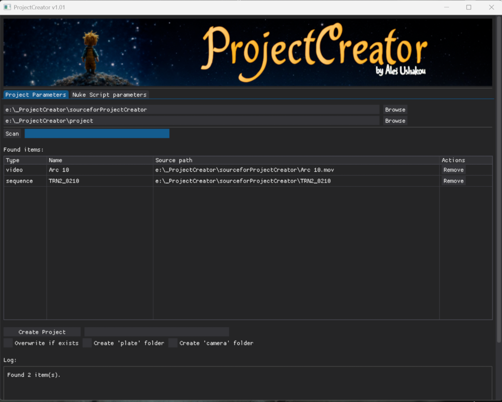
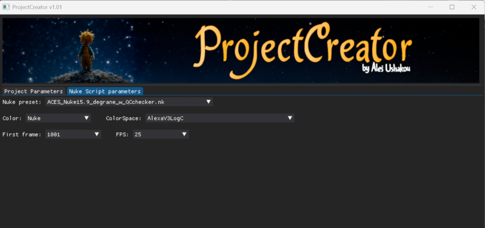

# 🎬 ProjectCreator v1.01

_Automated project folder and Nuke script creator — by Aleš Ushakou (2025)_


## 🧩 Overview

**ProjectCreator** is a Python-based GUI tool designed to streamline the setup of new compositing projects in **Nuke**.  
It automatically scans your footage or image sequences, creates organized folder structures, and generates `.nk` scripts with correct paths, color settings, and FPS — all configurable through a simple interface.
This tool was created to help **freelancers** and **small studios** organize their compositing workflow efficiently.

---

## 🖥️ Interface Preview

### 🧱 Project Parameters


- Select **source** and **destination** folders  
- Automatically detect `.mov`, `.mp4`, `.mxf`, or image sequences (`.exr`, `.dpx`, `.tiff`)  
- Displays detected items with “Remove” actions  
- Progress bars for *Scan* and *Create Project*  
- Checkboxes:
  - **Overwrite if exists**
  - **Create 'plate' folder**
  - **Create 'camera' folder**

---

### 🎨 Nuke Script Parameters


- Choose a **Nuke preset (.nk)** from the `/presets/` directory  
- Select:
  - **Color model** — Nuke or ACES  
  - **ColorSpace** — loaded from `ProjectCreator.ini`  
  - **First frame** and **FPS**

All settings are stored in `ProjectCreator.ini` and reused across sessions.

---

## 🗂️ Folder Structure Example

When creating a new project, the tool builds a clean and consistent structure:

```
project/
│
├─ Arc_10/
│   ├─ in/          → original .mov or .exr sequence
│   ├─ out/         → final renders
│   ├─ preview/     → pre-render outputs
│   ├─ comp/        → .nk project files
│   │   └─ Arc_10_comp_v001.nk
│
└─ TRN2_0210/
    ├─ in/
    ├─ out/
    ├─ preview/
    ├─ comp/
```

---

## ⚙️ Configuration: `ProjectCreator.ini`

Automatically generated on first launch.

```ini
[nuke]
preset = 
color_model = Nuke
colorspace = AlexaV3LogC
First frame = 1001
FPS = 25   

[First.frame]
1
1001

[FPS]
24
25
30

[colorspaces.Nuke]
AlexaV3LogC
ARRILogC4
linear
sRGB
rec709

[colorspaces.ACES]
"Input - ARRI - V3 LogC (EI800) - Wide Gamut"
"ACES - ACEScg"
"ACES - ACES2065-1"
"Utility - Linear - sRGB"
"Output - Rec.709"
```

You can edit this file manually to customize color options or add new presets.

---

## 🧠 Scripts Included

| File | Description |
|------|--------------|
| **ProjectCreator.py** | Main GUI app (DearPyGUI) for scanning and project creation. |
| **nuke_params.py** | Handles Nuke color settings, FPS, and user presets. |
| **create_nk.py** | Builds `.nk` scripts from templates and applies user parameters. |

---

## 🪄 Features

✅ Simple drag-and-drop style interface  
✅ Reads video or sequence formats automatically  
✅ Creates clean project structure (`in`, `out`, `preview`, `comp`)  
✅ Generates `.nk` scripts using your presets  
✅ Saves and recalls parameters via `ProjectCreator.ini`  
✅ Built-in progress indicators and item removal  
✅ Designed with a cinematic dark UI style  

---

## 🧰 Requirements

- **Python 3.9+**
- **Dear PyGui**  
- Other dependencies listed in `requirements.txt`

Install them with:
```bash
pip install -r requirements.txt
```

> For video files, **ffprobe.exe** (from FFmpeg) is required to detect frame count.  
> If not in PATH, download FFmpeg from [ffmpeg.org](https://ffmpeg.org) or [Gyan Builds](https://www.gyan.dev/ffmpeg/builds/)  
> and place `ffprobe.exe` inside a local `ffmpeg/` folder next to `ProjectCreator.py`.

---

## 🚀 Launch

Run directly:
```bash
python ProjectCreator.py
```

Or use a `.bat` launcher.

---

## 🖼️ Presets

Place your `.nk` templates inside the `presets/` folder:
```
presets/
└─ ACES_Nuke15.9_degrane_w_QCchecker.nk
```

These templates define the base structure for generated Nuke scripts.

---

## 🧑‍💻 Development Notes

- Version baseline for all scripts: **v1.01**
- Language: **Python**
- GUI: **Dear PyGui**
- OS: **Windows 10/11**
- Author: **Aleš Ushakou**
- Year: **2025**

---

## 🪶 License

MIT License © 2025 — Aleš Ushakou

You may use, modify, and distribute this software freely with credit.

---

## 💬 Contact

If you encounter bugs, ideas, or want to contribute —  
open an issue or pull request on GitHub.

📎 Connect with the author on [LinkedIn](https://www.linkedin.com/in/ale%C5%A1-ushakou-84250814/).

---

_“Time not for routine, but only for creativity!” — ProjectCreator 


---
