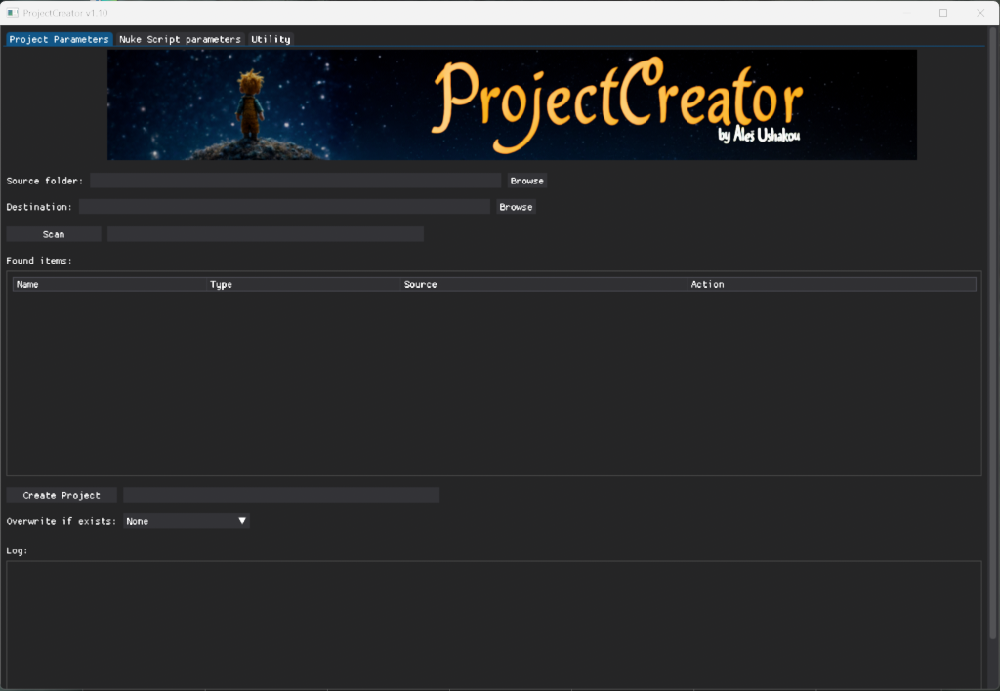
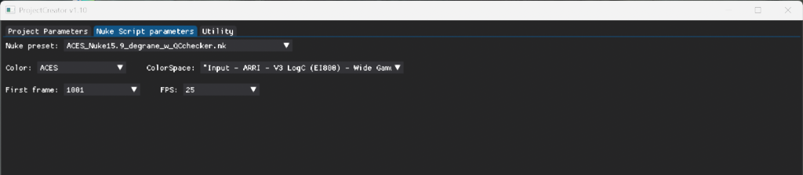
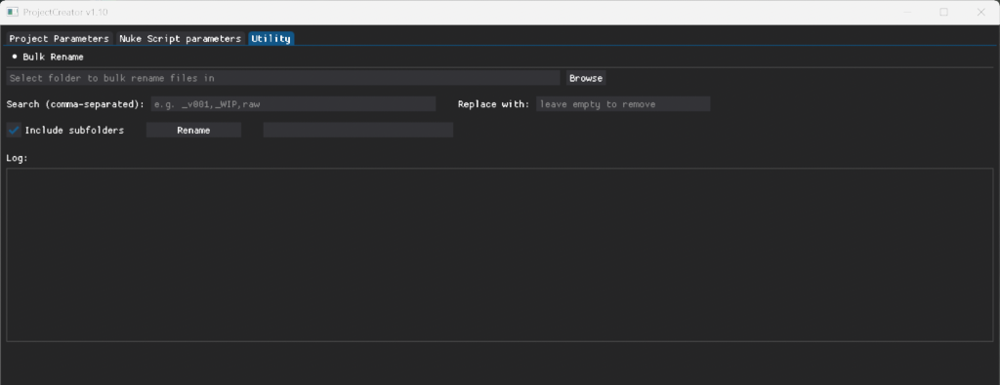

# 🎬 ProjectCreator


---

## 🧩 Overview

**ProjectCreator** is a Python-based GUI tool designed to streamline the setup of new compositing projects in **Nuke**.  
It automatically scans your footage or image sequences, creates organized folder structures, and generates `.nk` scripts with correct paths, color settings, and FPS — all configurable through a simple interface.

This project was created to help **freelancers** and **small studios** organize their compositing workflow efficiently and spend less time on repetitive setup tasks.

---

## 🖥️ Interface Preview

### 🧱 Project Parameters


- Select **source** and **destination** folders  
- Automatically detect `.mov`, `.mp4`, `.mxf`, or image sequences (`.exr`, `.dpx`, `.tiff`)  
- Displays detected items with “Remove” actions  
- Progress bars for *Scan* and *Create Project*  
- Overwrite options: **None**, **All**, **Source**, **Nuke Script**

---

### 🎨 Nuke Script Parameters


- Choose a **Nuke preset (.nk)** from the `/presets/` directory  
- Select:
  - **Color model** — Nuke or ACES  
  - **ColorSpace** — loaded from `ProjectCreator.ini`  
  - **First frame** and **FPS**

All parameters are saved automatically in `ProjectCreator.ini`.

---

### 🧰 Utility Tab


#### 🔤 Bulk Rename
- Select a folder and perform **batch renaming** of files  
- Use comma-separated search patterns (e.g., `_v001,WIP,raw`)  
- Optionally include subfolders  
- Replace or remove parts of filenames instantly  

---

## 🗂️ Folder Structure Example

When creating a new project, the tool builds a clean and consistent structure:

```
project/
│
├─ Arc_10/
│   ├─ in/          → source .mov or .exr sequence
│   ├─ out/         → renders
│   ├─ preview/     → preview outputs
│   ├─ comp/        → .nk project files
│       └─ Arc_10_comp_v001.nk
│
└─ TRN2_0210/
    ├─ in/
    ├─ out/
    ├─ preview/
    ├─ comp/
```

---

## ⚙️ Configuration: `ProjectCreator.ini`

Automatically created at first launch.

```ini
[nuke]
preset = 
color_model = Nuke
colorspace = AlexaV3LogC
First frame = 1001
FPS = 25   

[First.frame]
1
1001

[FPS]
24
25
30

[colorspaces.Nuke]
AlexaV3LogC
ARRILogC4
linear
sRGB
rec709

[colorspaces.ACES]
"Input - ARRI - V3 LogC (EI800) - Wide Gamut"
"ACES - ACEScg"
"ACES - ACES2065-1"
"Utility - Linear - sRGB"
"Output - Rec.709"
```

You can edit this file manually to customize color models, FPS, or default values.

---

## 🧠 Scripts Included

| File | Description |
|------|--------------|
| **ProjectCreator.py** | Main GUI app — scanning, folder creation, and Nuke integration |
| **nuke_params.py** | Manages Nuke color model, FPS, and preset selection |
| **create_nk.py** | Modifies `.nk` presets with correct paths and frame settings |
| **PCUtility.py** | Handles utility tools (e.g., Bulk Rename) |

---

## 🪄 Features

✅ Automatic detection of video & image sequences  
✅ Organized folder creation (`in`, `out`, `preview`, `comp`)  
✅ Uses `.nk` templates with injected parameters  
✅ Saves preferences in `ProjectCreator.ini`  
✅ Dual progress bars for *Scan* and *Create Project*  
✅ Built-in bulk rename utility  
✅ Clean dark interface built with **Dear PyGui**  

---

## 🧰 Requirements

- **Python 3.9+**
- **Dear PyGui**

Install all dependencies via:
```bash
pip install -r requirements.txt
```

> For video duration and frame count detection, **ffprobe.exe** (from FFmpeg) is required.  
> If not in PATH, download from [ffmpeg.org](https://ffmpeg.org) or [Gyan Builds](https://www.gyan.dev/ffmpeg/builds/)  
> and place `ffprobe.exe` inside a local `ffmpeg/` folder next to `ProjectCreator.py`.

---

## 🚀 Launch

Run directly:
```bash
python ProjectCreator.py
```

Or use a `ProjectCreator.bat` file launcher.

---

## 🖼️ Presets

Place your `.nk` templates in the `/presets/` folder:
```
presets/
└─ ACES_Nuke15.9_degrane_w_QCchecker.nk
```

These templates define the base structure for generated Nuke scripts.

⚠️ **Important:**  
When creating or editing a preset `.nk` file, **do not rename** the top-level **Read** and **Write** nodes.  
They must keep the original names:
- `Read_source`
- `Write_comp`
- `Write_preview`

Otherwise, ProjectCreator will not be able to correctly inject file paths and parameters.

---

## 🧾 Change Log

### v1.11 (Current)

- Added a progress bar for individual shots
- Fixed bugs when working with video files

### v1.10 
- Added **Utility** tab with **Bulk Rename** feature  
- Improved path resolution and INI handling  
- Better preset validation in `create_nk.py`  
- Enhanced progress bars and logging  
- Fixed header centering and scaling  
- Now Nuke script resolution is correctly set from **Read** node  
- Fixed incorrect `root_last` frame calculation in `create_nk.py`

### v1.01
- Introduced Nuke preset integration  
- Added color management from `.ini`  
- Implemented auto `.nk` generation  
- First public release


---

### Evolution

<a href="https://star-history.com/#AlesUshakou/ProjectCreator&Date">
  <picture width=640>
    <source media="(prefers-color-scheme: dark)" srcset="https://api.star-history.com/svg?repos=AlesUshakou/ProjectCreator&type=Date&theme=dark" />
    
  </picture>
</a>

---

## 🪶 License

MIT License © 2025 — Aleš Ushakou

You may use, modify, and distribute this software freely with credit.

---

## 💬 Contact

For suggestions, contributions, or bug reports —  
open an issue or pull request on GitHub.  

📎 Connect with the author on [LinkedIn](https://www.linkedin.com/in/ale%C5%A1-ushakou-84250814/)  
💻 GitHub: [AlesUshakou/ProjectCreator](https://github.com/AlesUshakou/ProjectCreator)

---

_“Time not for routine, but only for creativity!” — ProjectCreator_

---

### 🏷️ GitHub Topics
`nuke` • `python` • `vfx-tools` • `postproduction` • `freelance-tools` • `pipeline` • `automation`
